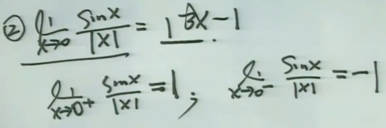
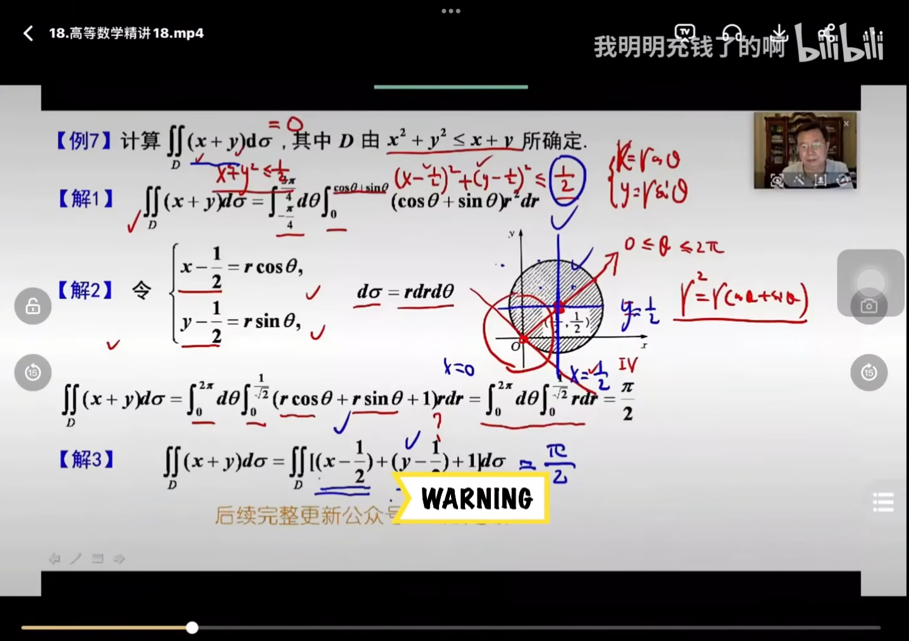
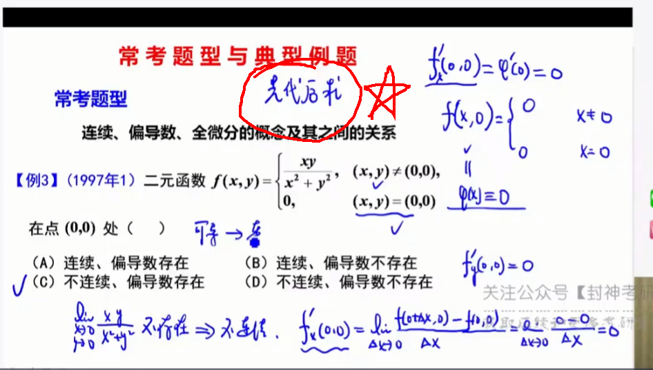
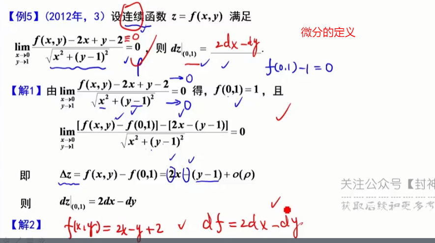
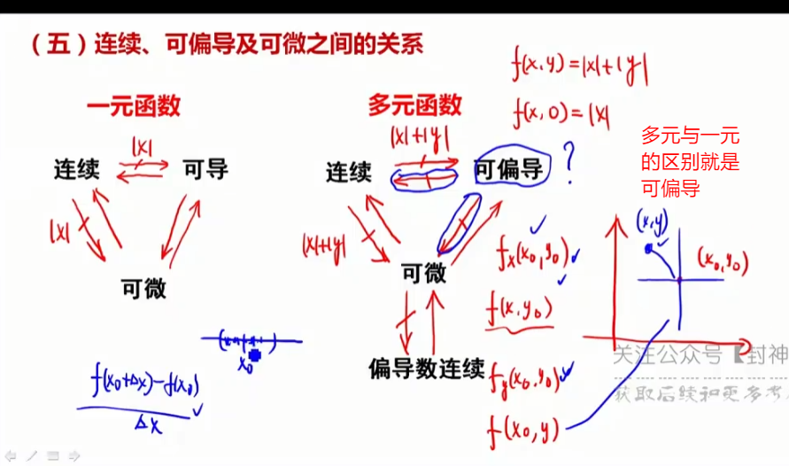

## 函数极限

存在必定唯一（唯一性）

## 利用形心公式做题

四种解法都很好。

## 多元函数微分学

# 660总结

# 选择题

## 1-21

求极限

## 22-28

函数可导性、连续性，根据连续性求a、b的值，间断点处的求导最不熟悉

## 29-42

求导，微分

## 43-50

三点、两性、一线

## 52-69

求积分，有一个定积分的精确定义（需要凑）

## 70-75

一元函数积分学的几何应用，求平面图形面积，旋转体体积，弧长、侧面积，（背公式）

## 76-84

微分，不熟练

## 85-104

偏导数

## 105-120

二重积分，111题将积分次序转换有一种峰回路转的感觉，113题不好理解，116题看到绝对值不要怕，直接分段考虑

# 填空题

## 121-122、126-128

数列极限，如何得到数列有界是难点（122，128）

## 125

不会做

## 129-137

求极限

## 138-140

等价无穷小

## 141-179

间断、连续、可导、可积、有界、三点两性一线

## 180-201

积分

## 202-204

积分的敛散性

## 205-210

积分求面积、体积、弧长、质心、物理上的积分

## 211-225

微分方程，

## 226-240

二元函数的可微，可偏导、可积，不好理解

## 241-246

求偏导

## 247-255

多元函数的极值、最值、驻点

## 256-275

二重积分的计算
