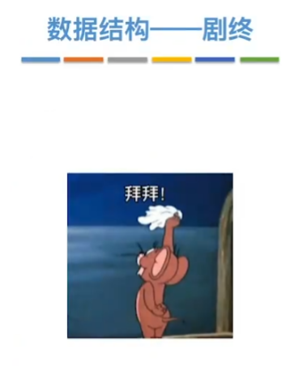

# 数据结构

## 第一章

**算法的时间复杂度**

https://blog.csdn.net/weixin_44001222/article/details/119306250

# 2023.3.10-->2023.5.8

# 数据结构总结

在5-8号学完数据结构，关于一些难点，不是很理解，

1、栈和队列的应用，括号匹配，表达式求值（求某个表达式在扫描到某个字符的，分析栈内的字符，课本92页11、12题），递归，队列可以用在层次遍历。

2、特殊矩阵的应用，压缩后下标的对应关系常考（不好算）

3、第四章串的模式匹配算法，KMP算法，如何求next数组，求比较的次数，课本115页

4、在第五章树那里，二叉树的遍历是重点（递归、非递归），线索二叉树没有理解，还有并查集（也是用的树形表示，find、union的优化）

5、图，图的表示法有很多种，图的遍历（深搜、广搜[ 层次遍历 ]，表示方法不同，时空复杂度不同），图的应用里面：最小生成树（prim，Kruskal），最短路径（Dijkstra单源，Floyd多源），拓扑排序，关键路径（还没看懂）

6、最后两章查找和排序，树形查找红黑树、平衡树，B树，B+树，他们的旋转是难点，排序主要是将几种算法综合起来问就记不住了，是不是要把代码背下来才好做点，还有一个是对趟数、比较次数的理解。

总的来说，主要是要背的东西，不算很难，就比如那些排序、查找算法的时空复杂度，都是要记住的。

就这样

选择题就算复习了一遍，大题的话估计得到7月中旬或者8月再去看了，看计组了

# 二刷难点 7-30

## 中缀转后缀

## KMP的Next数组和NextVal数组

视频讲解：[数据结构 串 KMP算法 next和nextvel](https://www.bilibili.com/video/BV1PG4y1V7Zq/?spm_id_from=333.337.search-card.all.click&vd_source=b99c7e40ffa0f64b68b706f2af755c8e)

KMP的next数组

NextVal数组

第二位的与第一位的不相同指的是模式串的第二位与第一位不相同，所以填1.

## 图的应用：最短路径问题

Dj 单源最短路径

Floyd 多源最短路径

## 红黑树RBT插入

知识点总结

红黑树删除的注意点

## 查找ASL失败的计算（书上例题）

使用除留余数法构造哈希函数，使用线性探测法处理冲突

# 王道强化

## 应用题常见考法

## 8-14二轮结束
