# 第二章

根据溢出标志位（OF）判断**补码**运算结果是否正确

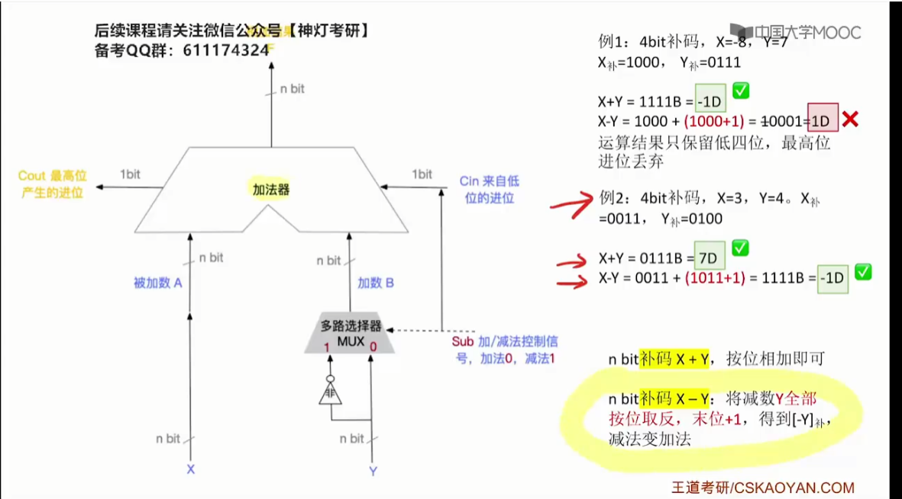

根据溢出标志位（OF）判断**无符号数**运算结果是否正确

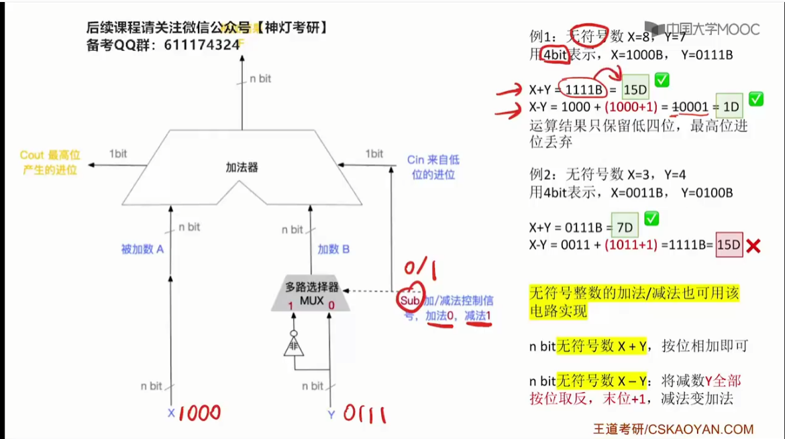

**与门电路的实现**

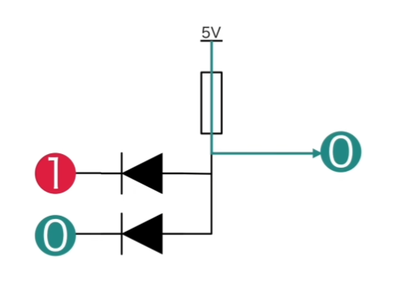

**或门**

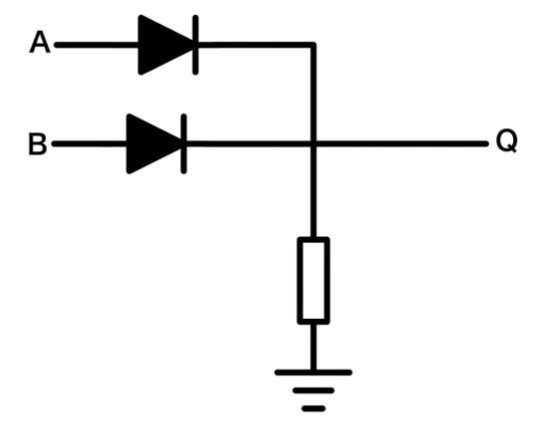

## 第二章总结：数据的运算和表示

**1**、**数制和编码**

**2**、**运算方法和运算电路**：加法器、定点数的加减乘除

**3**、**浮点数的运算**：IEEE754标准

# 第三章：存储系统

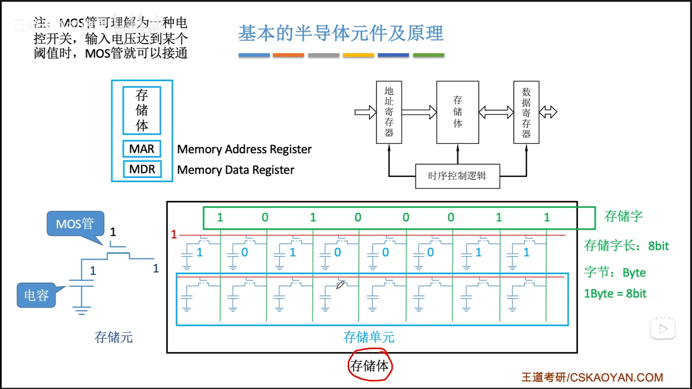

## DRAM v.s SRAM

栅极电容 DRAM

双稳态触发器 SRAM

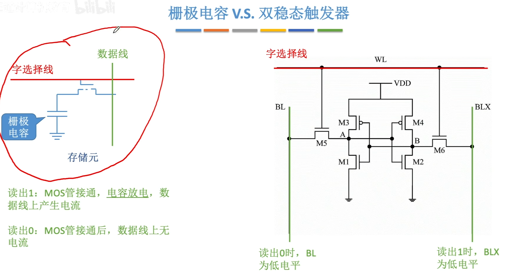

常考点，

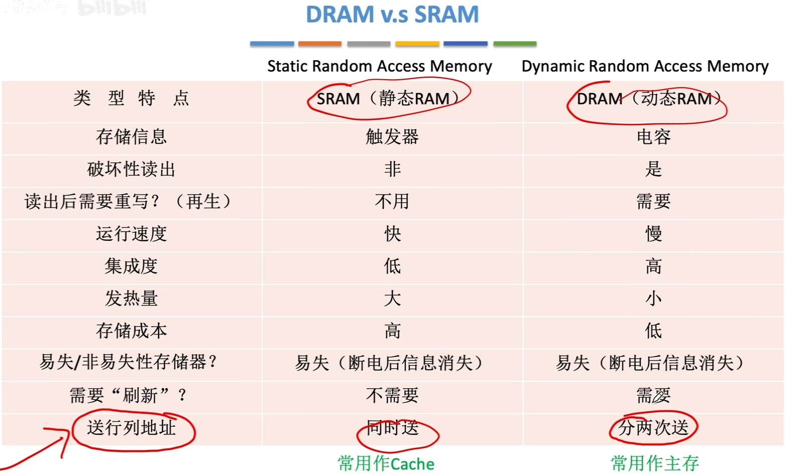

## DRAM地址复用技术

[DRAM 为什么采用地址复用技术](https://www.cnblogs.com/exungsh/p/15957909.html)

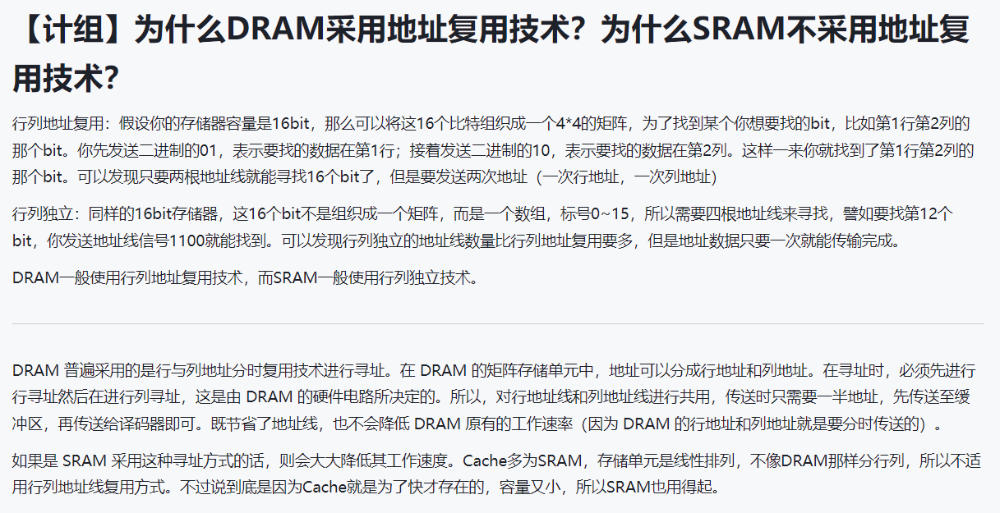

## 不好理解的磁盘平均存取时间

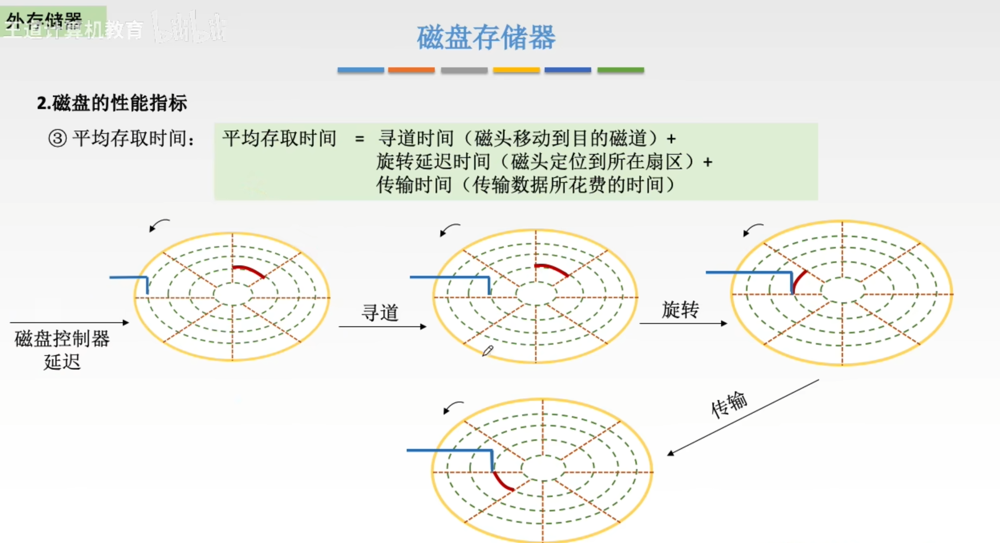

## Cache透明型分析

[Cache透明型分析](http://kjwy.5any.com/jsjxtjg/content/cl/jsjxtjg-kcjj-040507.htm)

## 访问数据的过程分析

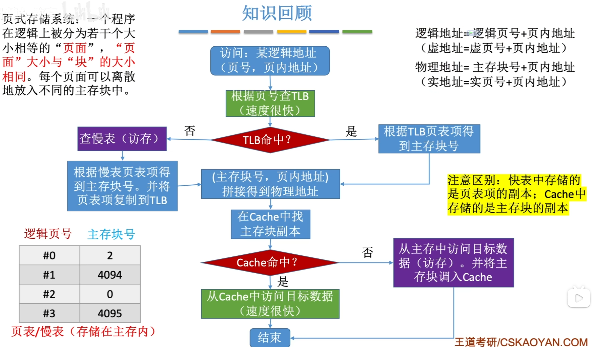

## 第三章总结

1、**主存储器**：DRAM、SRAM、多模块、字位扩展（**难点**求扩展后的芯片的首地址、尾地址）

2、**外部存储器**：磁盘（磁头、柱面、扇区，**难点**求磁盘的平均存取时间）、SSD

3、**Cache**：与主存的映射（**难点**求映射的时候的各个地址的位数）、替换算法（LRU等）、写策略（写命中、写不命中）

# 第四章

## 栈帧以及如何切换栈帧

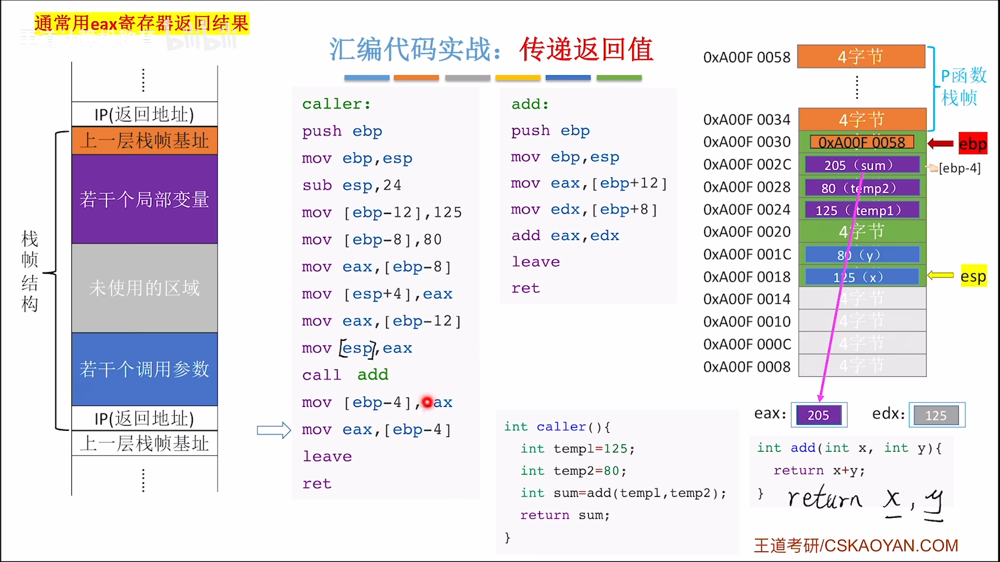

## 函数调用的汇编级表示

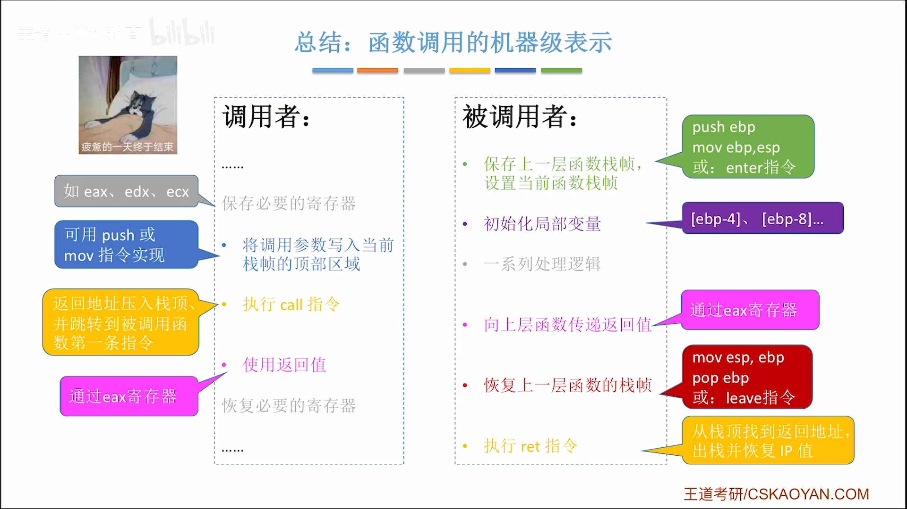

有点难！！

[视频地址，可以多听几遍](https://www.bilibili.com/video/BV1ps4y1d73V?p=58&vd_source=b99c7e40ffa0f64b68b706f2af755c8e)
