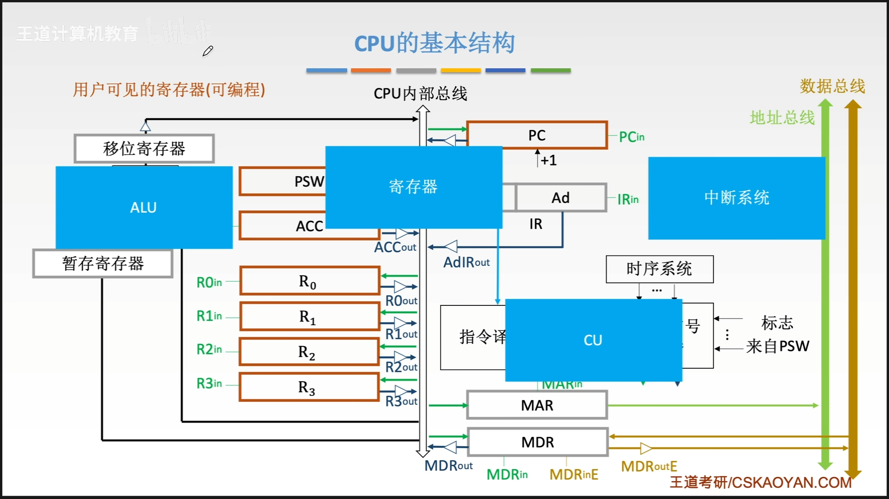

# 第二章：数据的表示和运算

根据溢出标志位（OF）判断**补码**运算结果是否正确

根据溢出标志位（OF）判断**无符号数**运算结果是否正确

**与门电路的实现**

**或门**

## 第二章总结：数据的运算和表示

**1**、**数制和编码**

**2**、**运算方法和运算电路**：加法器、定点数的加减乘除

**3**、**浮点数的运算**：IEEE754标准

# 第三章：存储系统

## DRAM v.s SRAM

栅极电容 DRAM

双稳态触发器 SRAM

常考点，

## DRAM地址复用技术

[DRAM 为什么采用地址复用技术](https://www.cnblogs.com/exungsh/p/15957909.html)

## 不好理解的磁盘平均存取时间

## Cache透明型分析

[Cache透明型分析](http://kjwy.5any.com/jsjxtjg/content/cl/jsjxtjg-kcjj-040507.htm)

## 访问数据的过程分析

## 第三章总结

1、**主存储器**：DRAM、SRAM、多模块、字位扩展（**难点**求扩展后的芯片的首地址、尾地址）

2、**外部存储器**：磁盘（磁头、柱面、扇区，**难点**求磁盘的平均存取时间）、SSD

3、**Cache**：与主存的映射（**难点**求映射的时候的各个地址的位数）、替换算法（LRU等）、写策略（写命中、写不命中），**考大题**

# 第四章：指令系统

## 栈帧以及如何切换栈帧

## 函数调用的汇编级表示

有点难！！

[视频地址，可以多听几遍](https://www.bilibili.com/video/BV1ps4y1d73V?p=58&vd_source=b99c7e40ffa0f64b68b706f2af755c8e)

## 第四章总结

1、**指令的格式和操作类型**：分成操作码字段和地址码字段，求指令条数，指令字长

2、**指令的寻址方式**：10种方式的对比（优缺点、适用范围）：有效地址的表达式、访存次数，多道程序设计（），编制循环程序（），寻址范围，基址寻址和变址寻址程序员的可控内容的区别

3、**常见的汇编指令**：函数调用过程栈帧的切换（call、ret），读懂汇编代码

4、**CISC和RISC**：结合下一章的微程序控制器和硬布线控制器考

# 第五章：中央处理器

## CPU内部结构组成

透明的寄存器（棕色）与不透明的寄存器（灰色），不透明代表可以编程，用户可见

## 第五章总结

1、**CPU的基本结构**：运算器、控制器，分别包含哪些单元和寄存器

2、**指令的执行过程**：指令周期（取址、间址、执行、中断），数据流（四个周期过程中PC、CU、MAR、MDR、IR等的变化）

3、**数据通路**：寄存器之间、主存和CPU之间、ALU执行计算功能，数据在总线的传输过程

4、**控制器**：硬布线、微程序，他们之间特点的对比

5、**异常和中断**：他们的分类，不同点（异常是CPU内部，中断是外部（通过中断请求线IR）），响应过程

6、**指令流水线**：将指令的执行分成五个过程分别执行，流水线的冒险和处理（对数据的争抢），性能指标（大题的一个小问）

7、**多处理器**

# 第六章：总线

## 第六章总结

1、**总线的基本概念**：分类（片内、**系统**、I/O，通信），结构，总线标准（ISA、EISA、PCI、PCI-E、**USB**），性能指标（带宽……）

2、**总线事务和定时方式**：总线事务就是请求总线的过程，定时方式控制请求总线的双方交换信息的同步关系，有三种（同步、异步、半同步）

# 第七章：输入/输出系统

## 第七章总结

1、I/O接口：功能，基本结构，类型，编址方式（统一、独立）

2、I/O方式：程序查询方式（类似while(true)……），程序中断方式（发出中断请求，CPU响应中断），DMA方式（高速设备，有一条直接数据通路，不需要经过CPU）。**考大题**

结束了

# 二轮
